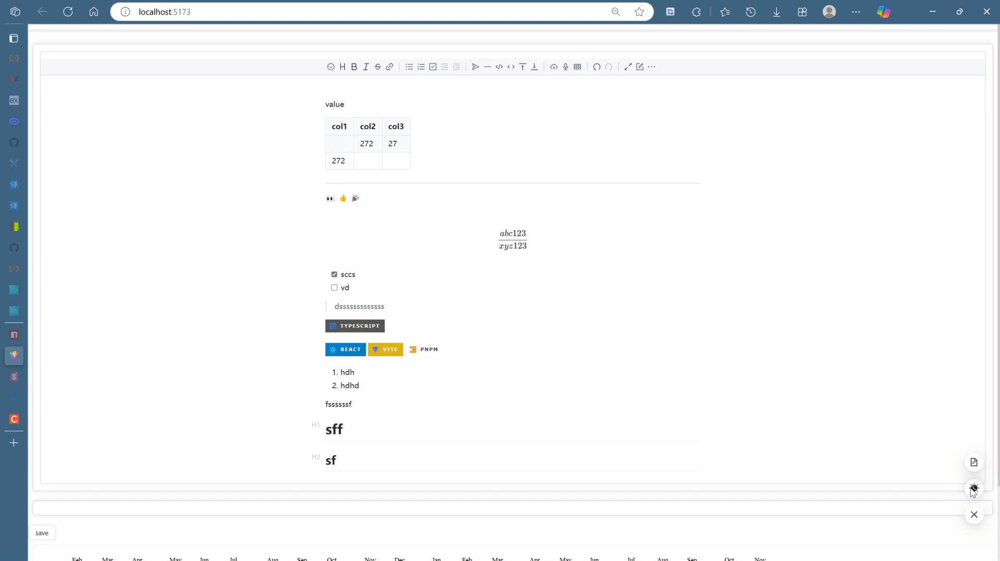
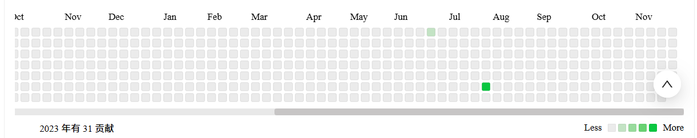
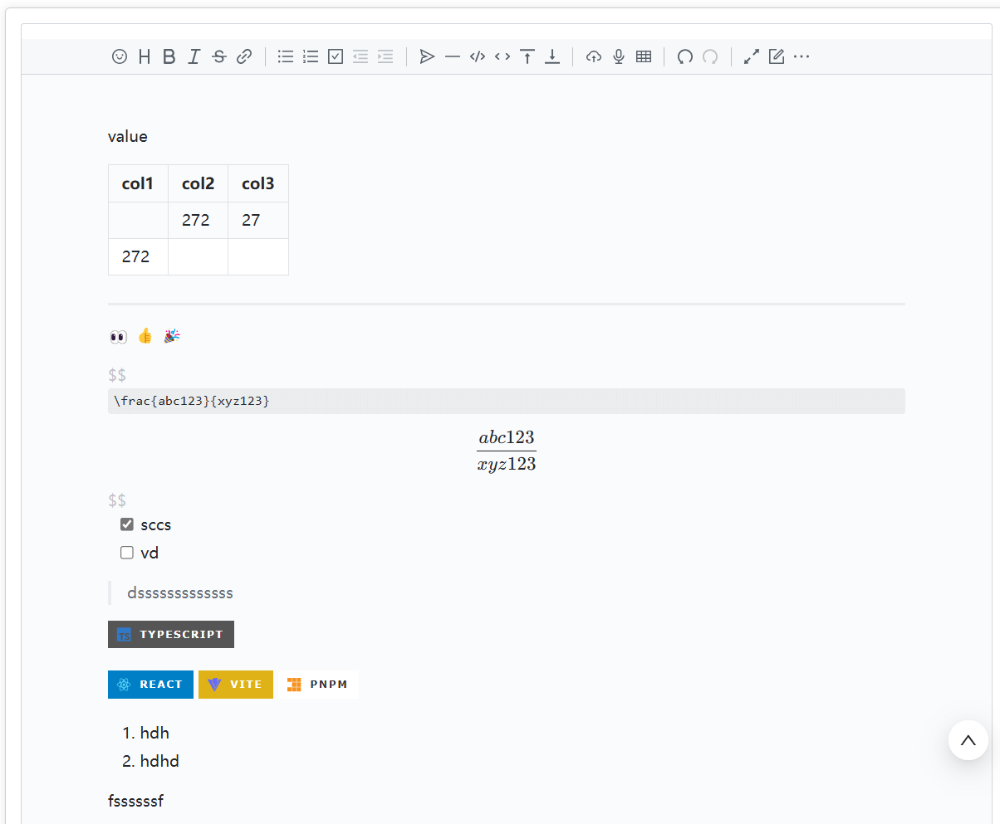

# MAXPURE

      

## Description

NOTES-CREATE/MANAGEMENT/SHARE/EXPLORE

## Features

- [x] Dark/Light Theme Switcher (SVG ClipPath Animation)
- [x] Calendar Contributes HeatMap
- [x] Markdown/RichText Editor & Previewer
- [x] Scroll Progress Bar

## Demo

### Theme Switcher

### Calendar Contributes HeatMap

### Markdown/RichText Editor & Previewer

## Installation

`pnpm i`
`pnpm dev`
